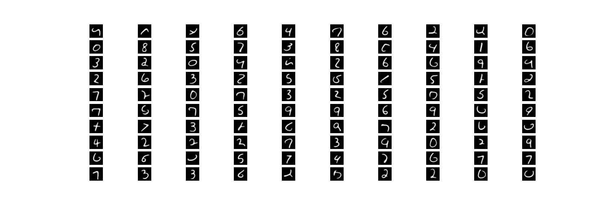
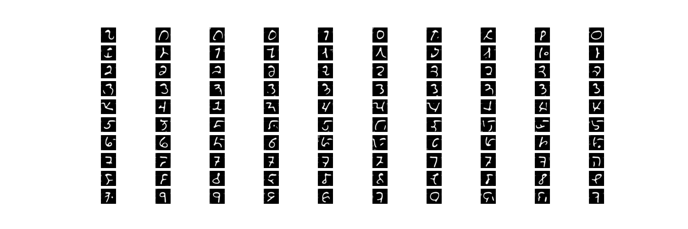

## DDPM with mini U-net
# Content:
- small size u-net, with encoder and decoder sharing same architecture
- an encoder to learn translational label embedding to the logit after bottleneck
- no self/cross attention mechanic
- no guidance
- no classifier for adversarial learning
- rope embedding for diffusion timestep 
  
#
#

# Discussion:
- artifacts on output (small circles and strikes), probably due to inefficient diffusion step
- the hyperparameter alpha need to be scale up during generating with regard to training (there are some insight but i don't have time to develop the theory)
- the rope embedding is only trained with 1~51, but sampling step is more than that (it shows extrapolation of rope embedding is valid even the training process doesnot contain them)
- no optimization objective to constrain translational label embedding
